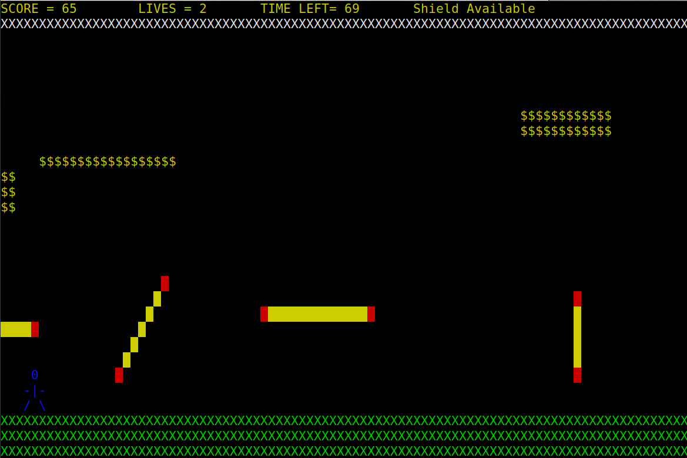

# Jetpack joyride

This is an amazing implementation of a subset of the Jetpack Joyride game. You will most probably enjoy it.

## Instructions

1. 'WAD' to move.
2. Fire Bullets with 'b'.
3. Activate shield with 'Space'.
2. Grab the Speed-Boost Powerup by jumping on it.
3. You can become a dragon too by taking Special Dragon Powerup.
4. Kill the final Boss-Enemy to win the game.

## Assignment related stuff

1. **Polymorphism** - both player and dragon have the `fire_laser` but it behaves differently in both of them, however, it is fired in the same way.
2. **Inheritance** - both player and bossenemey are inherited from same parent class `character`
3. **Encapsulation** - all variables are protected and they have getters and setters.
4. **Abstraction** - functions like `check_collision` and `fire_laser` hide underlying implementation and can be used in whatever way since it always works the way you want it to.

